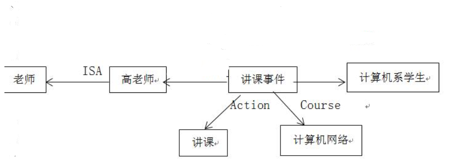

# 人工智能
## 绪论
1. 请你根据自己的理解，全面描述人工智能的概念。
> 人工智能是一门研究机器智能的学科，用人工的方法和技术研制智能机器或系统来模仿、延伸和扩展人的智能，实现智能行为。
2. 人工智能研究形成三种不同的研究学派，给出这三种学派的主要思想，并谈谈你对这三种学派的个人看法。
> - 符号主义：以符号处理为核心，用其模拟人类求解问题的心理过程
> - 连接主义：用人工神经网络模仿人类智能
> - 行为主义：智能取决于感知，表现为行为
## 知识表示
1. 将下列命题用谓词符号化。    
(1) 小王学过英语和法语。  
(2) 除非小王是东北人，否则他一定怕冷。     
(3) 小王的哥哥和小李的老师是亲戚。  
> 1. Eng(小王)^Fre(小王)  
> 2. 非 EN(小王)-> fearCold(小王)  
> 3.  Relative(bro(小王),teacher(小李))
2. 令谓词E（x）表示“说英语”，C（x）表示“会编程”，个体域为电信全体学生的集合。用量词和逻辑联接词符号表示列语句。  
（1）电信有个学生既会说英语又会编程。  
（2）电信所有学生或会说英语，或会编程。
> 1. (存在)(DX(x)-> E(x) and C(x))
> 2. (任意)(DX(x)-> E(x) or C(x))
3. 产生式的基本形式是什么？它和逻辑谓词的蕴含式有什么异同？
> 基本形式：P -> Q  
> 蕴含式仅能表示精确性知识；蕴含式是谓词公式，有真值；蕴含式总要求精确匹配
4. 简单阐述产生式系统的组成。
> 一个产生式产生的结论可以供另一个产生式作已知事实使用；组成包括：规则库(产生式的集合)，综合数据库(存放事实)，推理机
5. 在语义网络中，如何表示存在量词与全称量词？
> 存在量词：是一个、是一种...；全称量词：分块语义网络
6. 用语义网络表示：高老师给计算机系学生讲《计算机网络》课。
> 
7. 假设有以下一段天气预报：“北京地区今天白天晴，偏北风3级，最高气温12º，最低气温-2º，降水概率15%。” 请用框架表示这一知识。 
> 框架名：<天气预报>  
> 地区：北京  
> 时间：今天白天
> 天气：晴  
> 风向：偏北  
> 风力：3级  
> 气温：最高：12°  最低：-2°  
> 降水概率：15%  
1. 对比分析谓词、产生式、语义网络、框架、脚本、状态空间等知识表示方法
> - 谓词：一种形式语言，与人类自然语言较接近
> - 产生式：容易描述事实，清晰，模块，自然
> - 语义网络：通过概念和语义关系表示知识的网格图，较灵活
> - 框架：是语义网络一般化形式化的一种结构，易表示结构性知识
> - 脚本：一般用于描述一个过程而非静态知识
> - 状态空间：表示问题的全部可能状态和关系图
> 
## 搜索策略
1. 请阐述状态空间的一般搜索过程。OPEN表与CLOSED表的作用是什么？
> 状态空间的一般搜索过程  
> OPEN表：用于存放刚生成的节点  
> CLOSE表：用于存放将要扩展或已扩展的节点  
> 先把问题的初始状态作为当前扩展节点对其进行扩展，生成一组子节点，然后检查问题的目标状态是否出现在这些子节点中。  
> 若出现，则搜索成功，找到了问题的解；没出现，则再按某种搜索策略从已生成的子节点中选择一个节点继续扩展，重复上述过程直到目标状态出现或没有可供操作的节点为止。
2. 广度优先搜索与深度优先搜索各有什么特点？
> 广度优先搜索：始终先在同一级节点中搜索，搜索完后才搜索下一级节点，自顶向下逐渐生成。  
> 深度优先搜索：在每一层始终先扩展一个子节点，不停地纵向前进直到不能前进，才返回**上一级**节点，沿另一方向前进。
3. 简述迭代加深搜索并指明其优点。
> 在深度优先搜索中先设置一个深度限制，在限制内进行搜索，若搜索不到再扩大限制，继续搜索。
> 优点：能找到一条解路径，时空开销小于宽度优先。
4. 简述A*算法。
> f'(n)=g'(n)+h'(n)
5. 什么是零和博弈？
> 博弈中只有敌我两方，双方利益完全对立，赢得函数之和为0。
6. 简述α-β过程。
> 把生成后继和倒推值估计结合起来，及时减掉无用分支来提高算法的效率。
7. 什么是与或图？简述AO*算法。
> 由与节点和或节点组成的结构图，用来将问题替换为后继问题。
> AO*：适用于与或图的搜索算法，自上而下的图生长运算与自下而上的费用修正运算相结合。
8. 设有如下结构的移动将牌游戏：  
B B W W E   
其中，B表示黑色将牌，W表是白色将牌，E表示空格。游戏的规定走法是：  
(1) 任意一个将牌可移入相邻的空格，规定其代价为1；  
(2) 任何一个将牌可相隔1个其它的将牌跳入空格，其代价为2。  
游戏要达到的目标什是把所有W都移到B的左边。假设启发函数f(x)=d(x)+h(x)，d(x)为已经付出的代价，h(x)=每个W左边的B的个数，请给出整个搜索过程。

## 确定性推理
1. 什么是推理？
> 按某种策略，从已知事实出发推出结论。
2. 什么是合一？什么是MGU？
> 寻找项对变量的置换，使两个谓词公式一致。
3. 简述自然演绎推理。
> 从一组已知为真的事实出发，直接运用经典逻辑的推理规则推出结论。
> 最基本规则为三段论推理，P推Q，Q推R，则P推R
4. 什么是Skolem标准形？
> 由子句合取构成的式子  
> eg：(﹁P(X,f(X))∨Q(X,g(X))∧(﹁P(X,f(X))∨﹁R(X,g(X)))
5. 判断下列公式是否为可合一，若可合一，则求出其最一般合一  
(1)  P(f(x), b), P(y, z)  
(2)  P(f(x), y), P(y, f(b))  
(3)  P(f(y), y, x), P(x, f(a), f(b))
> 1. 可合一
> 2. 可合一
> 3. 不可合一
> 不可合一：差异集内无变量；只有一个元素；含有x和f(x)
6. 下列子句集中哪些是不可满足的？给出归结过程。  
    (1) { P∨Q , ¬P∨Q,  P∨¬Q, ¬P∨¬Q }  
    (2) {P(x)∨Q(x)∨R(x) , ¬P(y)∨R(y), ¬Q(a), ¬R(b)}
> 归结不出空子句即不可满足
7. 用归结原理求解：  
已知：(1) 如果x和y是同班同学，则x的老师也是y的老师；  
(2) 王先生是小李的老师；  
(3) 小李和小张是同班同学。问小张的老师是谁？
> 定义谓词-->谓词公式表示-->化为子句集-->归结

## 不确定推理
1. 设有如下推理规则   
   r1:  IF  E1  THEN  (100, 0.1)  H1  
   r2:  IF  E2  THEN  (50, 0.5)  H2  
   且已知P(H1)=0.02, P(H2)=0.2  
   请计算：  
   当证据E1，E2存在或不存在时P(Hi | Ei)、P(Hi |﹁Ei)的值各是多少(i=1, 2)？ 
> (LS,LN)

2. 设有如下一组推理规则:  
r1:  IF  E1  THEN  E2 (0.6)  
r2:  IF  E2  AND  E3  THEN  E4 (0.7)  
r3:  IF  E4  THEN  H (0.8)  
r4:  IF  E5  THEN  H (0.9)   
且已知CF(E1)=0.5,  CF(E3)=0.6,  CF(E5)=0.7  
求CF(H)=? 
> CF(H)=CF1+CF2-CF1*CF2

## 专家系统
1. 什么是专家系统？
> 是一种具有大量专门知识与经验的智能计算机系统，能够模拟专家的思维过程，使计算机能像人类专家一样解决实际问题。
2. 专家系统的主要组成部分有哪些？简述每部分的功能。
> - 知识库：存储在计算机中的知识的集合
> - 推理机：实现推理的程序
> - 动态数据库：存放初始事实，推理结果和控制信息等数据的集合
> - 人机界面：用户与专家系统的交互界面
> - 解释模块：向用户解释专家系统的行为和结果

## 神经网络
1. 简述监督学习、无监督学习和再励学习。
> - 监督学习：神经网络根据目标输出和实际输出的误差调节网络参数
> - 无监督学习：根据外部数据的统计规律调节系统参数以反应数据的特性
> - 再励学习：外部环境对网络输出给出评价信息，网络通过强化受奖励的动作来改善性能
2. 简述BP神经网络。
> 是一种按照误差，反向传播，从而调整权值和阈值来进行训练的神经网络
3. 简述SOM神经网络，SOM能够用于模拟函数逼近吗？
> 神经网络接收到外界输入时，会分为不同的对应区域，各区域对输入有不同的响应特征；可以用于模拟函数逼近

## 遗传算法
1. 试述遗传算法的基本原理，并说明遗传算法的求解步骤。 
> 算法随机生成一定个体，每个个体被评价，通过选择，交叉，变异产生下一代个体，逐代向增加整体适应度的方向发展，直到满足终止条件。  
> 步骤：编码-->产生初始群体-->计算适应度-->选择-->交叉-->变异-->终止 
2. 什么是阶和定义距？简述模式定理。
> 阶： 模式中确定位置的个数  
> 定义距： 模式中第一个确定位置和最后一个确定位置之间的距离，代表在遗传操作中被破坏的可能  
> 模式定理： 𝑚(𝐻,𝑡+1)=𝑚(𝐻,𝑡)·𝑓(𝐻)/¯𝑓 适应度高于种族平均适应度值的模式，下一代会有更多的代表
3. 简述遗传算法、进化策略和进化规划的主要区别。
> - 都是从随机产生的初始可行解出发，经过进化择优，逐渐逼近最优解  
> - 进化策略采用十进制实数表达问题，遗传算法是二进制  
> - 算子不同，进化策略的变异-->旧个体添加随机数；遗传算法-->某些个体的个别位变异  
> - 选择不同，进化策略从x个新个体或x+y个个体重挑选z个个体组成新群体；遗传算法从旧群体中择优插入新个体  
> - 执行顺序不同；进化策略先重组，变异，最后选择；遗传算法先进行选择和复制，之后为交叉，最后才是变异  
> - 进化规划 只依靠变异产生新个体，进化策略采用重组和变异两种手段 

## 机器学习
1. 什么是机器学习？
> 机器在某类任务上，对性能的度量随着经验E而完善，则该机器从经验E中学习
2. 简述ID3算法(决策树算法)？
> ID3算法是自顶向下的增长树的贪婪算法，每个节点选取能最好地分类样例的属性，直到这棵树完美分类或所有属性都被使用
   
## 支持向量机
1. 简述SVM的基本原理。
> SVM是一种二分类模型，目的是找到一个超平面使其能够正确划分训练数据集并且使数据集的间隔最大化
> - 当样本线性可分时，通过硬间隔最大化，学习线性SVM
> - 样本近似线性可分时，引入松弛变量，通过软间隔最大化，学习线性SVM
> - 线性不可分时，通过使用核技巧及软间隔最大化，学习非线性SVM
2. 什么是VC维？
> 衡量函数复杂度的一个指标
3. 什么是核函数？
> 样本在原始空间中不可分，需要映射到更高维的特征空间，并在其中线性可分，而样本在特征空间中的内积等于他们在原始样本空间中通过核函数K计算的结果